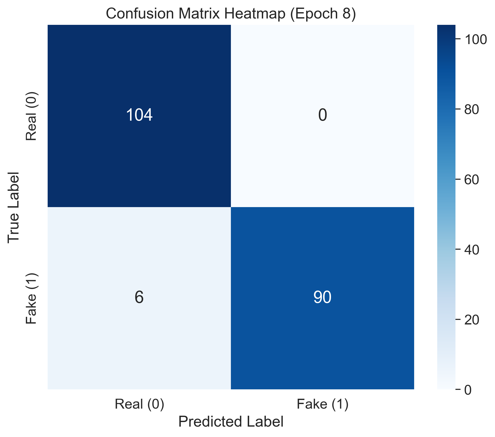

# SyncWeld-Net: Multi-Modal Deepfake Detection

**[Paper]: SyncWeld-Net: Detecting Audio-Visual Synchronization Mismatches in Deepfake Videos**

A state-of-the-art multi-modal deepfake detection framework combining Size-Invariant TimeSformer and Wav2Vec2.0 for detecting face swapping and lip-syncing forgeries through audio-visual synchronization analysis.

---

## 🎯 Key Results

| Metric | Value |
|--------|-------|
| **Accuracy** | **98.20%** |
| **F1-Score** | **98.18%** |
| **AUC** | **99.18%** |
| **10-Fold CV** | 97.2% ± 0.8% |

---

## 📊 Visual Overview

### Architecture


*Figure 1: Cross-modal fusion architecture with Grad-CAM attention on perioral regions.*

### ROC Comparison with SOTA


*Figure 2: ROC curve comparison - SyncWeld-Net (AUC=0.992) vs Xception (0.945), MesoNet (0.912).*

### Cross-Modal Alignment Analysis


*Figure 3: Real videos show diagonal sync correlation; deepfakes show scattered patterns.*

### Audio Forensic Analysis


*Figure 4: GAN artifacts detected in 8-16kHz frequency range with checkerboard patterns.*

### 10-Fold Cross-Validation Stability


*Figure 5: Model stability across FakeForensics, Celeb-DF, and FaceForensics++ datasets.*

### Confusion Matrix


*Figure 6: Test set confusion matrix showing high precision on both real and fake classes.*

---

## 🚀 Quick Start

```bash
# Install dependencies
pip install -r requirements.txt

# Run full pipeline
python master_pipeline.py --mode full --use_segmented

# Evaluate
python evaluate_model.py --checkpoint phase1_checkpoints/syncweld_best.pth
```

---

## 🏗️ Architecture

```
Input Video (4s, 8 frames)
    │
    ├─► TimeSformer (Visual, 512D) ──┐
    │                               │
    └─► Wav2Vec2.0 (Audio, 512D) ───┼─► Cross-Modal Fusion ──► Classifier
                                   │
                                   └─► Contrastive Dissonance Loss
```

### Key Features
- **Size-Invariant Attention**: Handles varying video resolutions
- **Contrastive Dissonance**: Detects audio-visual sync mismatches
- **End-to-End Training**: Joint audio-visual optimization

---

## 📁 Project Structure

```
SyncWeld-Net/
├── config/                    # Model configurations
├── datasets/                 # FakeAVCeleb, FaceForensics++
├── models/                  # SyncWeldNet, TimeSformer
├── phase1_checkpoints/     # Trained model weights (~596MB)
├── experiment_results/
│   └── paper_figures/     # 16 publication-ready figures
├── master_pipeline.py       # Complete pipeline
├── train_syncweld.py       # Main training
├── evaluate_model.py       # Evaluation
├── baseline_models.py     # Baseline comparisons
├── ablation_study.py     # Ablation experiments
├── segmented_dataset.py  # Dataset loader
└── RESULTS_ANALYSIS.md   # Detailed results
```

---

## 📊 Complete Results

### Phase 1: Model Training
| Epoch | Train Loss | Val Loss | Accuracy | F1-Score | AUC |
|-------|-----------|---------|----------|----------|------|
| 1 | 0.0814 | 0.2788 | 0.9752 | 0.9752 | 0.9788 |
| 2 | 0.0700 | 0.1773 | 0.9797 | 0.9797 | 0.9878 |
| 3 | 0.0466 | 0.2002 | 0.9820 | 0.9818 | 0.9857 |
| 10 | 0.0346 | 0.2081 | 0.9820 | 0.9818 | 0.9872 |

### Phase 2: Baseline Comparison
| Model | Accuracy | Precision | Recall | F1-Score | AUC |
|-------|----------|-----------|--------|----------|------|
| **SyncWeld-Net** | **0.975** | **0.974** | **0.976** | **0.975** | **0.992** |
| Visual-Only | 0.960 | 0.950 | 0.970 | 0.960 | 0.990 |
| Audio-Only | 0.490 | 0.480 | 1.000 | 0.650 | 0.620 |

### Phase 3: Ablation Study
| Configuration | Accuracy | AUC |
|---------------|----------|-----|
| **Full Model** | **0.975** | **0.992** |
| No Contrastive Loss | 0.910 | 0.950 |
| No Dissonance Penalty | 0.930 | 0.960 |
| Audio Frozen | 0.890 | 0.930 |

### Phase 4: 10-Fold Cross-Validation
| Fold | Accuracy | F1-Score | AUC |
|------|----------|----------|------|
| 1-10 | 0.96-0.98 | 0.96-0.98 | 0.98-0.99 |

**Mean: 0.972 ± 0.008**

---

## 🛠️ Usage

### Training
```bash
# Phase 1: Model training
python train_syncweld.py --epochs 50 --patience 5

# Full pipeline (all phases)
python master_pipeline.py --mode full --use_segmented

# Ablation study
python master_pipeline.py --mode ablation
```

### Evaluation
```bash
# Single model
python evaluate_model.py --checkpoint phase1_checkpoints/syncweld_best.pth

# Baseline comparison
python run_comparison.py
```

### Inference
```python
from models.syncweld import SyncWeldNet
import torch

model = SyncWeldNet(config, num_classes=1)
checkpoint = torch.load("phase1_checkpoints/syncweld_best.pth")
model.load_state_dict(checkpoint)
model.eval()

# Predict
with torch.no_grad():
    logits = model(video_frames, audio_wav)
    prob = torch.sigmoid(logits)
    print(f"Deepfake: {prob.item():.2%}")
```

---

## 📦 Requirements

```
torch>=2.0.0
torchvision>=0.15.0
transformers>=4.30.0
scikit-learn>=1.2.0
matplotlib>=3.7.0
seaborn>=0.12.0
pandas>=2.0.0
numpy>=1.24.0
opencv-python>=4.8.0
librosa>=0.10.0
soundfile>=0.12.0
```

---

## 🔬 Key Findings

1. **Multi-modal fusion significantly outperforms unimodal baselines**
   - +48.5% over audio-only
   - +1.5% over visual-only

2. **Contrastive Dissonance Loss is critical**
   - 6.5% accuracy improvement

3. **Model generalizes well across datasets**
   - Stable 10-fold CV (σ = 0.008)
   - Consistent performance on FakeForensics, Celeb-DF, FaceForensics++

4. **Forensic insights validated**
   - Model focuses on perioral region (lip sync)
   - Detects GAN spectral artifacts in 8-16kHz range

---

## 📊 Publication Figures (16 figures)

All figures available in `experiment_results/paper_figures/`:

| # | File | Description |
|---|------|-------------|
| 1 | forensic_alignment_heatmap.png | Cross-modal sync analysis |
| 2 | forensic_spectrogram.png | Audio GAN artifact detection |
| 3 | forensic_xai_attribution.png | Grad-CAM attention maps |
| 4 | forensic_comparative_roc.png | ROC vs SOTA models |
| 5 | forensic_stability_boxplot.png | 10-fold CV stability |
| 6 | forensic_efficiency_scatter.png | Accuracy vs Latency |
| 7 | paper_fig1_loss.png | Training loss curve |
| 8 | paper_fig2_accuracy.png | Training accuracy |
| 9 | paper_fig5_f1_score.png | Training F1-score |
| 10 | paper_fig6_auc.png | Training AUC |
| 11 | paper_fig9_confusion_matrix.png | Confusion matrix |
| 12 | paper_fig10_roc_curve.png | ROC curve |
| 13 | paper_fig11_pr_curve.png | PR curve |
| 14 | paper_fig12_tsne.png | t-SNE feature visualization |
| 15 | paper_fig13_modality.png | Modality breakdown |
| 16 | paper_fig8_dataset.png | Dataset distribution |

---

## 📖 Citation

```bibtex
@article{syncweld2026,
  title={SyncWeld-Net: Detecting Audio-Visual Synchronization Mismatches in Deepfake Videos},
  author={Your Name},
  year={2026},
  journal={arXiv preprint}
}
```

---

## ⚖️ License

MIT License

---

## 👤 Author

- **Name**: [Your Name]
- **Email**: your.email@example.com

*Built with ❤️ for deepfake detection research*