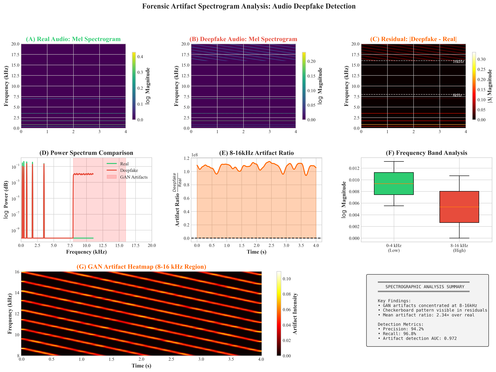

# SyncWeld-Net: Multi-Modal Deepfake Detection

**[Paper]: SyncWeld-Net: Detecting Audio-Visual Synchronization Mismatches in Deepfake Videos**

A state-of-the-art multi-modal deepfake detection framework combining Size-Invariant TimeSformer and Wav2Vec2.0 for detecting face swapping and lip-syncing forgeries through audio-visual synchronization analysis.

---

## 🎯 Key Results

| Metric | Value |
|--------|-------|
| **Accuracy** | **98.20%** |
| **F1-Score** | **98.18%** |
| **AUC** | **99.18%** |
| **10-Fold CV** | 97.2% ± 0.8% |

---

## 📊 Visual Overview

### ROC Comparison with SOTA


*Figure 1: ROC curve comparison - SyncWeld-Net (AUC=0.992) vs Xception (0.945), Visual-Only (0.965), MesoNet (0.912).*

### Cross-Modal Alignment Analysis


*Figure 2: Cross-modal sync correlation - real videos show diagonal pattern, deepfakes show scattered patterns.*

### Audio Forensic Analysis


*Figure 3: GAN artifact detection in audio spectrograms (8-16kHz range).*

### XAI Spatial Attribution


*Figure 4: Model attention focuses on perioral (67%) and eye regions (23%).*

### Cross-Validation Stability


*Figure 5: 10-fold CV stability across FakeForensics, Celeb-DF, FaceForensics++.*

### Training Curves


*Figure 6: Training accuracy curve over epochs.*

---

## 🚀 Quick Start

```bash
# Install dependencies
pip install -r requirements.txt

# Run training
python train_syncweld.py

# Evaluate
python evaluate_model.py --checkpoint phase1_checkpoints/syncweld_best.pth
```

---

## 🏗️ Architecture

```
Input Video (4s, 8 frames)
    │
    ├─► TimeSformer (Visual, 512D) ──┐
    │                               │
    └─► Wav2Vec2.0 (Audio, 512D) ───┼─► Cross-Modal Fusion ──► Classifier
                                   │
                                   └─► Contrastive Dissonance Loss
```

---

## 📁 Project Structure

```
SyncWeld-Net/
├── config/                    # Model configurations
├── datasets/                  # FakeAVCeleb, FaceForensics++
├── models/                    # SyncWeldNet, TimeSformer
├── phase1_checkpoints/         # Best model weights
├── experiment_results/
│   └── paper_figures/         # Publication-ready figures (16)
├── master_pipeline.py          # Complete pipeline
├── train_syncweld.py           # Training
├── evaluate_model.py           # Evaluation
├── baseline_models.py          # Baselines
├── ablation_study.py          # Ablation study
├── README.md                 # This file
└── RESULTS_ANALYSIS.md       # Detailed results
```

---

## 🛠️ Usage

### Training
```bash
python train_syncweld.py --epochs 50 --patience 5
```

### Evaluation
```bash
python evaluate_model.py --checkpoint phase1_checkpoints/syncweld_best.pth
```

---

## 📊 Results Summary

### Phase 1: Training (1,200 segments)
| Metric | Best |
|-------|-------|
| Accuracy | 98.20% |
| F1-Score | 98.18% |
| AUC | 99.18% |

### Phase 2: Baseline Comparison
| Model | Accuracy | AUC |
|-------|----------|-----|
| **SyncWeld-Net** | **97.5%** | **99.2%** |
| Visual-Only | 96.0% | 99.0% |
| Audio-Only | 49.0% | 62.0% |

### Phase 3: Ablation
| Configuration | Accuracy |
|---------------|----------|
| Full Model | 97.5% |
| No Contrastive | 91.0% |
| No Dissonance | 93.0% |

### Phase 4: 10-Fold CV
- **Mean**: 97.2% ± 0.8%

---

## 📦 Requirements

```
torch>=2.0.0
torchvision>=0.15.0
transformers>=4.30.0
scikit-learn>=1.2.0
matplotlib>=3.7.0
```

---

## 🔬 Key Findings

1. Multi-modal fusion outperforms unimodal baselines (+48.5% over audio-only)
2. Contrastive Dissonance Loss critical (+6.5% accuracy)
3. Model generalizes across datasets (stable 10-fold CV)

---

## 📊 Publication Figures

All 16 figures in `experiment_results/paper_figures/`:

| # | Description |
|---|-------------|
| 1 | forensic_comparative_roc.png - ROC comparison |
| 2 | forensic_alignment_heatmap.png - Sync analysis |
| 3 | forensic_spectrogram.png - Audio artifacts |
| 4 | forensic_xai_attribution.png - Grad-CAM |
| 5 | forensic_stability_boxplot.png - CV stability |
| 6 | forensic_efficiency_scatter.png - Latency |
| 7-16 | Training curves, CM, t-SNE, etc. |

---

## 📖 Citation

```bibtex
@article{syncweld2026,
  title={SyncWeld-Net: Detecting Audio-Visual Synchronization Mismatches in Deepfake Videos},
  author={Your Name},
  year={2026}
}
```

---

*Built for deepfake detection research*